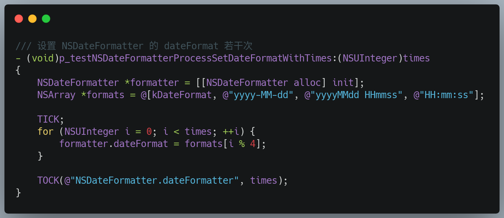

# WJXDateFormatter

## 1. 为什么会有这篇文章？

做为一个 iOS 移动开发者，避免不了要和日期时间 `NSDate` 打交道，而 `NSDate` 的格式化就“避免不了”要用到 `NSDateFormatter`。

然而，只要我们稍微在网上看一看有关 App 性能的文章，就会遇到关于 `NSDateFormatter` 的各种“丑恶传说”，使人见 `NSDateFormatter` 而色变，比如下面这段：

> ……要重用一些高消耗的对象，如 `NSDateFormatter`。解决方法：可以将其作为@property、甚至是静态变量作为单例在 App 中使用。另外，`NSDateFormatter` 的 `setDateFormat` 同样也是一个非常消耗资源的操作。

`NSDateFormatter` 消耗性能不假，但是真的如上所说吗？

为了求真（一时兴起），特意熬夜（熬夜等于自杀，小伙伴们珍重哦）做了个 App 来验证一下，并将过程和结果记录下来与大家分享。

## 2. `NSDateFormatter` 的性能瓶颈到底在哪里？

在 iOS 开发中，用 `NSDateFormatter` 格式化 `NSDate` 通常有三个过程， 性能瓶颈也就会出现在这其中：

1. 创建 `NSDateFormatter` 对象；
2. 设置 `NSDateFormatter.dateFormat`;
3. 使用 `NSDateFormatter` 将 `NSDate` 格式化。

### 2.1 编写瓶颈测试代码

为此，我们新建一个iOS 项目，语言采用 `Objective-C`。

为了好计时，做了一对宏定义 TICK-TOCK：

其中， `TICK` 用来记录开始时间，`TOCK` 输出两个宏定义之间所经历的时间，以毫秒计，所以两个时间差值乘以1000，另外为了增加 log 可读性，添加了 `__FUNCTION__` 和 `__LINE__`，考虑到多处需要计时而且每次计时次数也不一样，给宏添加了两个参数，一个是计时的描述，一个是次数。

接着，我们添加一个宏定义 `kDateFormat`，表示项目中使用的一种常用的日期格式

然后，借助 [XLForm](https://github.com/xmartlabs/XLForm) 构建一个有三个条目的表，“[NSDateFormatter init]”表示创建过程，“NSDateFormatter.dateFormat”表示设置 dateFormat 的过程, “NSDateFormatter format date”表示格式化的过程。

每个条目点击可以选择执行次数，分别是1次，10次、100次、1,000次、10,000次、100,000次、1,000,000次。

在选择次数之后，分别执行相应的测试代码，如下面三段：

### 2.2 真机测试瓶颈

至此，代码算是全了，终于可以连接我的 iPhone 7 Plus（iOS 12.2) 测试啦！

| Item \ Times(ms) | 1T | 10T | 100T | 1,000T | 10,000T | 100,000T | 1,000,000T |
|----------------|----|-----|------|--------|---------|----------|------------|
| NSDateFormatter.init | 0.041962 | 0.061035 | 0.359893 | 3.479958 | 23.254037 | 81.120014 | 523.313999 |
| NSDateFormatter.dateFormat | 0.044107 | 0.012040 | 0.077009 | 0.756979 | 8.394957 | 56.271076 | 327.851057 |
| NSDateFormatter.stringFromDate | 1.374006 | 0.870943 | 4.078984 | 20.212054 | 73.418021 | 452.300072 | 4243.968010 |
| 比值 | 3.1:3.2:100 | 7.0:1.4:100 | 8.9:1.9:100 | 17.2:3.7:100 | 31.7:11.4:100 | 17.9:12.4:100 | 12.3:7.7:100 |

这里需要注意一点，测试时一定要用真机，毕竟我们的 App 是要跑在用户的真机上的。另外，为了各测试阶段互不影响，每次进程只测一项，然后重新启动 App 再测下一项。

从上表中的测试数据可以看到，第一个阶段的 1T : 10T ≈ 2 : 3，如果两次测试在一次进程中，那么 1T : 10T > 1.0，很明显，我们可以推断出，一个 App 进程在初次创建 `NSDateFormatter` 对象时，需要初始化比较多的相关资源并做了缓存以供之后再次创建对象时使用。

### 2.3 结论

很显然，最影响性能的是第三过程——日期格式化字符串的过程，其次是第一过程—— `NSDateFormatter` 的创建过程，第二过程（也就是设置 `NSDateFormatter` 的 `dateFormat` 过程）对性能的影响是最小的，可以忽略。

## 3. 如何优化？

知道了 `NSDateFormatter` 的瓶颈所在，我们就可以做出针对性的优化策略。网上比较一致的说法是缓存每一种 `dateFormat` 和 `locale` 使用组合的 `NSDateFormatter`。也有少见的几篇文章推荐使用 `C` 语言标准库的 `strftime` 函数。

于是，马上在 Terminal 上输入 `man strftime` 命令，一查究竟。

>     #include <time.h>
>
>     size_t
>     strftime(char *restrict s, size_t maxsize, const char *restrict format,
>         const struct tm *restrict timeptr);
>
>     #include <time.h>
>     #include <xlocale.h>
>
>     size_t
>     strftime_l(char *restrict s, size_t maxsize, const char *restrict format,
>         const struct tm *restrict timeptr, locale_t loc);

`strftime` 接收四个参数，第一个是 `C` 的字符指针类型，指向一个用于存储格式化日期字符串的 buffer，第二个参数表明这个 buffer 的最大 size，第三个参数是日期格式，第四个表示一个 `struct tm` 类型的指针，可以通过 `localtime(&timeInterval)` 获得。

`strftime_l` 与 `strftime` 的区别就是 `strftime_l` 可以通过第五个参数指明 `locale`，而 `strftime` 是直接使用的当前的 `locale`。

补充完 `strftime` 的知识，接下来我们将从三种使用场景进行评测：

1. 不缓存 `NSDateFormatter` 对象，每次用新创建的格式化；
2. 缓存 `NSDateFormatter` 对象，每次用这个缓存的格式化；
3. 使用 `strftime` 格式化；

### 3.1 编写格式化测试代码

打开刚才的项目，继续添加三项条目 “NSDateFormatter without cache“、”NSDateFormatter with cache“ 和 ”strftime“分别对象上一节所说的三个场景。

三个测试场景的代码分别如下：

### 3.2 真机测试格式化方式

再次连接我的 iPhone 7 Plus（iOS 12.2) 测试，得到如下数据：

| Item \ Times(ms) | 1T | 10T | 100T | 1,000T | 10,000T | 100,000T | 1,000,000T |
|----------------|----|-----|------|--------|---------|----------|------------|
| NSDateFormatter w/o cache | 3.041983 | 2.995968 | 18.599987 | 75.766921 | 413.509011 | 3892.683029 | 39286.973000 |
| NSDateFormatter w/ cache | 4.864097 | 0.452042 | 3.893018 | 23.145080 | 79.674959 | 459.233046 | 4310.497999 |
| strftime | 0.093937 | 0.038981 | 0.787020 | 4.451036 | 42.822003 | 147.675991 | 1469.401956 |
| 比值 | 100:160:1.3 | 100:15:1.3 | 100:21:4.2 | 100:30.5:5.9 | 100:19.3:10.4 | 100:11.8:3.8 | 100:11:3.7 |

### 3.3 结论

通过对比，很容易得出结论，缓存 `NSDateFormatter` 相比 不缓存 `NSDateFormatter` 的方式，可以提高 35%~90% 的性能，而 `strftime` 更是能将性能提升 90% 左右。对于性能敏感的项目和追求极致的童鞋来说，`strftime` 自然是首选。

## 4. 未完，待续...

本着对 iOS developer 最舒服的姿势封装了一下从 `NSDateFormatter` 到 `strftime` 的 format 的映射关系 `WJXNSDateFormatterToStrftimeFormatMapper`，但是效果并不理想。

| Item \ Times(ms) | 1T | 10T | 100T | 1,000T | 10,000T | 100,000T | 1,000,000T |
|----------------|----|-----|------|--------|---------|----------|------------|
| NSDateFormatter w/o cache | 3.041983 | 2.995968 | 18.599987 | 75.766921 | 413.509011 | 3892.683029 | 39286.973000 |
| NSDateFormatter w/ cache | 4.864097 | 0.452042 | 3.893018 | 23.145080 | 79.674959 | 459.233046 | 4310.497999 |
| strftime | 0.093937 | 0.038981 | 0.787020 | 4.451036 | 42.822003 | 147.675991 | 1469.401956 |
| NSStringFromTimeIntervalSince1970InStrftime | 0.051022 | 0.139952 | 0.765920 | 10.101080 | 44.474006 | 176.205993 | 1457.680941 |
| NSStringFromNSDate | 0.553012 | 0.221014 | 2.177000 | 16.422987 | 44.955969 | 310.889006 | 2847.805977 |
| 比值 | 100:160:1.3:1.7:18.2 | 100:15:1.3:4.7:7.4 | 100:21:4.2:4.1:11.7 | 100:30.5:5.9:13.3:21.7 | 100:19.3:10.4:10.8:10.9 | 100:11.8:3.8:4.5:8 | 100:11:3.7:3.7:7.2 |

疫情严重，保重身体，注意休息。夜已深，暂且这样。

武汉加油！中国加油！
